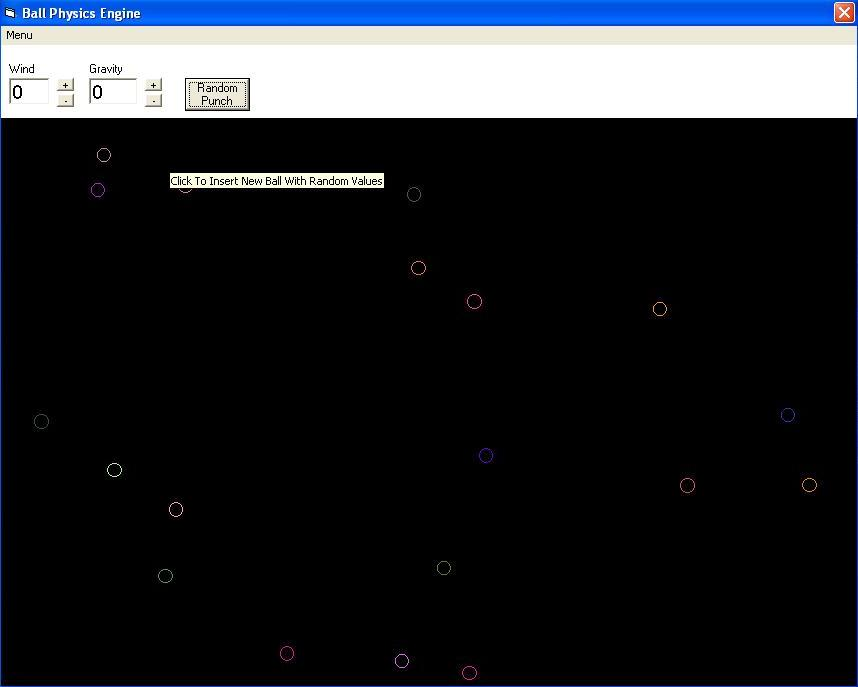



## Ball Physics Simple Engine

### Description

This is a simple Physics Engine designed for balls.

Its simple but solid.Very simple to use basicaly point and click.
 
### More Info
 

             |
---                |---
**Submitted On**   |2009-12-13 11:30:40
**By**             |[HLMODER](https://github.com/Planet-Source-Code/PSCIndex/blob/master/ByAuthor/hlmoder.md)
**Level**          |Intermediate
**User Rating**    |4.0 (8 globes from 2 users)
**Compatibility**  |VB 6\.0
**Category**       |[Games](https://github.com/Planet-Source-Code/PSCIndex/blob/master/ByCategory/games__1-38.md)
**World**          |[Visual Basic](https://github.com/Planet-Source-Code/PSCIndex/blob/master/ByWorld/visual-basic.md)
**Archive File**   |[Ball\_Physi21702112132009\.zip](https://github.com/Planet-Source-Code/hlmoder-ball-physics-simple-engine__1-72733/archive/master.zip)

